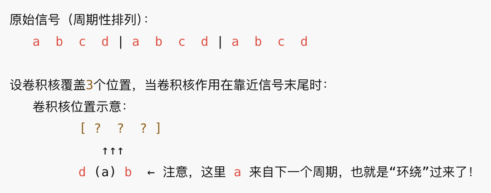

## outline
- 图像分解和线性时不变系统
- 二维傅立叶变换
- 图像采样
  
___

## 图像分解和线性时不变系统

#### 图像数学表达
图像由基本的像素点组成，如果将每一个像素点看作一个脉冲，则每个像素点的值可以看作是脉冲的幅值，这样图像就可以看作是由一系列脉冲组成的。

单个像素点的数学表达式：
$$f(i,j) = A\delta(x-i,y-j)$$
其中，A是像素点的幅值，$\delta(x-x_0,y-y_0)$是二维脉冲函数，表示在$(x_0,y_0)$处的脉冲。

则图像可表示为一些列脉冲的叠加，其数学表达式：
$$f(x,y) = \sum_{i=1}^{N} \sum_{j=1}^{N} f(i,j)\delta(x-i,y-i)$$
其中，N是图像中的像素点个数，A_i是第i个像素点的幅值，$(x_i,y_i)$是第i个像素点的坐标。

#### 图像处理系统
$$
\ f(x,y) \rightarrow \begin{array}{|c|}
\hline
\text{image processing T} \\
\hline
\end{array} \rightarrow g(x,y)
$$

其中，f(x,y)是输入图像，g(x,y)是输出图像, T是图像处理系统.
所以数学表达式为：
$$g(x,y) = T[f(x,y)] = T\left[\sum_{i=1}^{N} \sum_{j=1}^{N} f(i,j)\delta(x-i,y-i)\right]$$

如果T是线性的，则有：
$$g(x,y) = \sum_{i=1}^{N} \sum_{j=1}^{N} f(i,j)T[\delta(x-i,y-i)]$$

令 $h(x,y) = T[\delta(x,y)]$，即为T的冲激响应。
如果T是时不变系统，则h(x,y)是固定的，不随输入的位置变化，可以在整个空间内平移。则有：
$$g(x,y) = \sum_{i=1}^{N} \sum_{j=1}^{N} f(i,j)h(x-i,y-i)=f(x,y)*h(x,y)$$

- 只用时不变系统才能用卷积计算，时不变系统指的是输入信号发生平易，输出信号也发生平移，不会因位置的不同而产生额外的变化。
$$ T \{\delta(x-i,y-j)\} = h(x-i,y-j) $$
- h(x,y)也就是滤波器，是固定的，不随输入的位置变化，则其在空间内平移就可以计算图像输出，而不需要做额外的变化。
- 如果h(x,y)是变化的，则在不同的位置输出不一样，不能用单一的h(x,y)来计算输出。

## 二维傅立叶变换
傅立叶变换为将信号从时域转化为频域。其核心思想是将一个信号分解为不同频率的正弦波叠加。其视觉呈现可参考3B1B的视频。
https://www.youtube.com/watch?v=spUNpyF58BY&t=441s

#### 基础公式
- 欧拉公式：$$ e^{i\theta} = \cos\theta + i\sin\theta $$
- 连续傅立叶变换：$$ F(u,v) = \int_{-\infty}^{\infty}\int_{-\infty}^{\infty}f(x,y)e^{-i2\pi(ux+vy)}dxdy $$
- 离散傅立叶变换：$$ F(u,v) = \sum_{x=0}^{M-1}\sum_{y=0}^{N-1}f(x,y)e^{-i2\pi(ux/M+vy/N)} $$
- 逆傅立叶变换：$$ f(x,y) = \int_{-\infty}^{\infty}\int_{-\infty}^{\infty}F(u,v)e^{i2\pi(ux+vy)}dudv $$
- 离散傅立叶变换的逆变换：$$ f(x,y) = \frac{1}{MN}\sum_{u=0}^{M-1}\sum_{v=0}^{N-1}F(u,v)e^{i2\pi(ux/M+vy/N)} $$
- 傅立叶变换具有可分离性，即：$$ F(u,v) = \int_{-\infty}^{\infty}\left[\int_{-\infty}^{\infty}f(x,y)e^{-i2\pi vy}dy\right]e^{-i2\pi ux}dx = \int_{-\infty}^{\infty}F_x(u,y)e^{-i2\pi ux}dx $$
- 离散傅立叶变换的可分离性：$$ F(u,v) = \frac{1}{MN}\sum_{x=0}^{M-1}\left[\sum_{y=0}^{N-1}f(x,y)e^{-i2\pi vy/N}\right]e^{-i2\pi ux/M} = \frac{1}{M}\sum_{x=0}^{M-1}F_x(u,y)e^{-i2\pi ux/M} $$

#### DFT 性质
傅立叶变换得到的频谱图像是复数，通常用幅度谱和相位谱来表示，幅度谱是复数的模，相位谱是复数的辐角。数学表达：$$ F(u,v) = R(u,v) + jI(u,v)= |F(u,v)|e^{i\theta(u,v)} $$
其中：$$ |F(u,v)| = \sqrt{R^2(u,v) + I^2(u,v)} $$$$ \theta(u,v) = \arctan\left(\frac{I(u,v)}{R(u,v)}\right) $$
在图像应用中，通常用幅度谱来表示频谱图像，因为幅度谱包含了图像的主要信息，而相位谱则包含了图像的细节信息。

- 周期性 $$ F(u,v) = F(u+m,v) = F(u,v+n) $$
- 共轭对称性 $$ F(u,v) = F^*(-u,-v) $$
- 线性性 $$ aF_1(u,v) + bF_2(u,v) = F(au,v) + F(bu,v) $$
- 卷积 $$
f(x,y) * g(x,y) = \int_{-\infty}^{\infty} \int_{-\infty}^{\infty} f(\alpha, \beta) g(x - \alpha, y - \beta) d\alpha d\beta \\
f(x,y) * g(x,y) \iff F(u,v) G(u,v) \\
f(x,y) g(x,y) \iff F(u,v) * G(u,v) $$
- 旋转
$$
x = r \cos \theta, \quad y = r \sin \theta, \quad u = \omega \cos \varphi, \quad v = \omega \sin \varphi \\
f(r, \theta + \theta_0) \iff F(\omega, \varphi + \theta_0)
$$
- 旋转不变性 
$$
g(u,v) = \frac{1}{\pi} \int_0^{2\pi} \int_0^1 e^{-j(2\pi ur^2 + v\theta)} f(r, \theta) dr d\theta
$$

#### zero padding
zero padding 主要是为了要解决周期性混叠以及循环卷积的问题。采样定理是解决信号混叠的问题，不能解决循环卷积以及周期性混叠的问题。

首先要了解周期延拓的概念：在DFT变换时，隐式的认为信号是无限重复的。

因为信号是无限周期重复的，所以在做卷积运算时，当计算至数据的末尾时，会将下一个周期的头部数据纳入计算，出现循环卷积的现象。

也正是因为这种计算方式，导致可能会将图片的左边和右边混在一起。所以需要在图片两边做zero padding.

- zero padding 的尺寸
  - DFT 计算一维信号时，如果有2个信号分别为 N 和 M，那么需要做 zero padding 到 N+M-1 的尺寸
  - DFT 计算二维信号时，如果有2个信号分别为 NxM 和 PxQ，那么需要做 zero padding 到 (N+P-1)x(M+Q-1) 的尺寸

#### 为什么滤波用DFT, 而图像压缩用DCT？
- DFT 计算为复数，可以同时表示信号的幅度和相位信息，便于详细的滤波处理。
- DCT 计算为实数，减少了存储和计算的复杂性。
- DCT 变换后大多数的能量集中在低频信号，更符合人眼的视觉特性。

## 图像采样