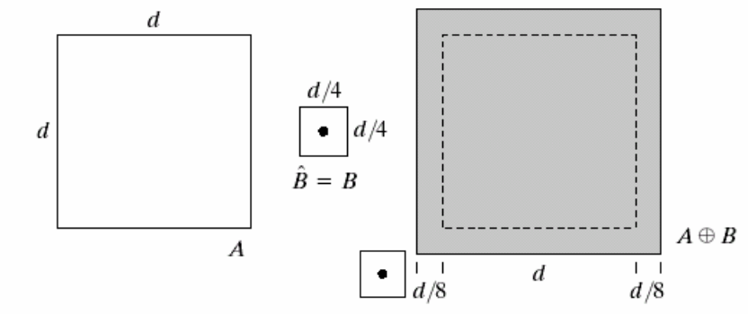
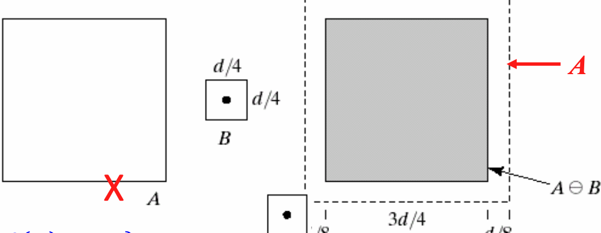
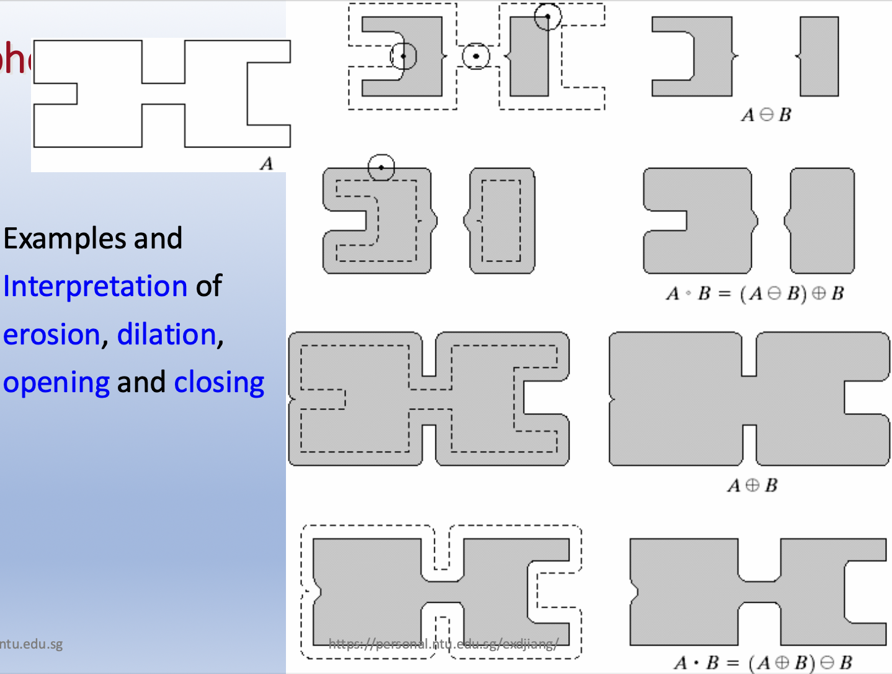

## Outline

- Introduction
- 集合论与逻辑运算
- Dilation 和 Erosion
- 开运算与闭运算
- 形态学算法和应用

## Introduction

形态学（Morphology）不关注像素的具体灰度值，只关注像素的几何分布和结构。

- 最常见的处理对象是二值图像，但也可以处理灰度图像。
  二值图像可以定义为像素集：

  $$
  A = \{ a \mid a = (x, y), f(x, y) = 1 \}
  $$

  其中 $f(x, y)=1$ 代表白色区域，$f(x, y)=0$ 代表黑色区域。
- 用于提取图像中的结构信息的有效工具。

  - 表示或者描述图片的形状、边界
- 通常作为图像分割或者边缘检测的前处理或者后处理步骤

## 集合论与逻辑运算公式

| **Operation**   | **Equation**                                                     | **Description**                                                |
| --------------------- | ---------------------------------------------------------------------- | -------------------------------------------------------------------- |
| **Translation** | $(A)_z = \{ w \mid w = a + z, \text{ for } a \in A \}$               | 将$A$ 平移到 $z$，主要用于图像的几何变换，比如平移、旋转、缩放等 |
| **Reflection**  | $\hat{B} = \{ w \mid w = -b, \text{ for } b \in B \}$                | 围绕原点反射$B$中所有元素，用于计算膨胀、腐蚀等中的结构元素变换    |
| **Complement**  | $A^c = \{ w \mid w \notin A \}$                                      | 计算$A$的补集，主要用于翻转黑白像素。                              |
| **Difference**  | $A - B = \{ w \mid w \in A, w \notin B \}$ ` ` $= A \cap B^c$ | 从$A$中去除 $B$的元素，主要用于目标提取，或者去除小噪声         |
| **Dilation**    | $A \oplus B = \{ z \mid (\hat{B})_z \cap A \neq \emptyset \}$        | 扩张$A$的边界，主要用于连接相邻区域，增强前景区域等                |
| **Erosion**     | $A \ominus B = \{ z \mid (B)_z \subseteq A \}$                       | 缩小$A$的边界，主要用于去除噪声，分割目标等                        |

#### Dilation (膨胀)

膨胀可以看作是用结构元素扫描图像，如果遇到相同的元素，则膨胀图像。计算后目标区域会变大，边界会向外扩张。

$$
A \oplus B = \{ z \mid (\hat{B})_z \cap A \neq \emptyset \}
$$

其中，$A$是输入图像，$B$是结构元素，用于定义膨胀操作的作用范围。$\hat{B}$表示$B$的反射，即$\hat{B} = \{ -b \mid b \in B \}$，而$(B)_z$表示$B$平移到位置$z$。

公式表示：如果$(\hat{B})_z$与$A$有交集，则$z$属于膨胀后的图像。

- 之所以要用$\hat{B}$，而不是直接用$B$主要原因是为了保证dilation和erosion的对偶性。
- 结构元素可以是不同的形状，会影响膨胀的方式。
  - 方形，均匀向各个方向扩张
  - 圆形，适合处理曲线和圆形目标
  - 十字形，适合水平和垂直方向的扩张，适合处理线条和边缘
- 可以类比为卷积运算，$B$可以看作是卷积核，翻转之后滑动到图像的各个位置计算

图形理解：

#### Erosion(腐蚀)

腐蚀主要是可以看作是结构元素在图像上滑动，如果结构元素的所有像素都在图像中，则保留该像素，否则去除该像素。计算后目标区域会变小，边缘像素会被去除，比如孤立的噪声点。

$$
A \ominus B = \{ z \mid (B)_z \subseteq A \}
$$

膨胀和腐蚀是对偶运算，可以理解为：

- 膨胀的补集等于腐蚀补集的膨胀
- 腐蚀的补集等于膨胀补集的腐蚀

图像理解：

#### Opening(开运算)

开运算是一种复合运算方式，先腐蚀后膨胀，可以平滑对象边界，去除小噪声，保留主要结构。

$$
A \circ B = (A \ominus B) \oplus B
$$

- 先腐蚀移除噪声，缩小目标区域
- 再膨胀恢复目标区域，避免图像变小
- 问题： 可能在移除噪声时将图片的细小的点移除，导致膨胀的时候无法膨胀会原来的图像细节。

主要应用：

- 图像去噪
- 分割图像中连接的区域
- 边缘检测
- 医学图像处理、字符识别OCR等

#### Closing(闭运算)

闭运算是开运算的对偶运算，先膨胀后腐蚀，可以平滑对象边界，填充小孔，保留主要结构。

$$
A \bullet B = (A \oplus B) \ominus B
$$

- 先膨胀连接目标区域，消除小孔
- 再腐蚀恢复主体形状，避免过度拓展
- 风险：引入边缘噪声

主要应用：

- 填充孔洞
- 连接断裂区域
- 消除目标的小凹陷或者边缘缺失的部分

图像解释：

- 备注
  - $A$ 是 $A \bullet B$ 的子集
  - $A \circ B$ 是 $A$ 的子集

#### 图像学算法

**边界提取**

$$
\beta(A) = A - (A \ominus B)
$$

**区域填充**

$$
X_k = (X_{k-1} \oplus B) \cap A^c,
$$

$$
A^F = X_k \cup A
$$

**提取联通区域**

$$
X_k = (X_{k-1} \oplus B) \cap A, \quad k = 1,2,3,\dots
$$

**去噪**

- 去除小颗粒噪声，细小孤立点

$$
(A \circ B) \bullet B
$$

- 填充内部噪声，在清理边缘干扰

$$
(A \bullet B) \circ B
$$
