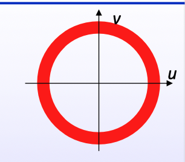
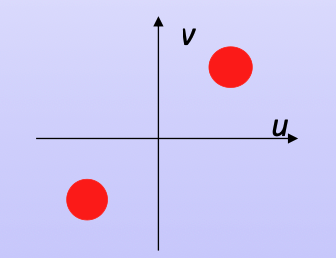

## outline

- Introduction
- 噪声以及退化模型
- 逆滤波
- 维纳滤波(Wiener Filtering)
- 频域滤波

本部分内容基于EE7403，不属于EE6222部分。

## Introduction

图像恢复是基于数学模型的客观的恢复过程，需要关于退化过程的先验知识对图像进行重建。因此许多修复技术都是需要假设退化过程。

与图像增强对比：
- 图像增强是一个主观的过程，改善视觉的效果，不需要考虑恢复原始信息
- 图像恢复是一个客观的过程，需要恢复原始的信息

图像可能会退化的原因：
- 相机噪声
- 运动模糊
- 失焦
- 传输干扰

因为图像退化之后会导致很多重要的信息丢失，所以需要在进一步处理之前先恢复图像。

## 噪声以及退化模型

LSI/LTI 线性空间不变/线性时不变的退化模型：
- 属于比较简单的模型，显示还存在非线性退化模型以及空间可变模型
- 主要适用于运动模糊，失焦，传输干扰等

退化模型：
$$
g(x,y) = h(x,y) * f(x,y) + \eta(x,y) = \sum_{i=-\infty}^{\infty} \sum_{j=-\infty}^{\infty} f(i,j) h(x-i, y-j) + \eta(x,y)
$$

$$
\Updownarrow \quad \text{(Fourier Transform)}
$$

$$
G(u,v) = H(u,v) F(u,v) + N(u,v)
$$
其中：$\eta(x,y)$ 为加性不相关噪声。

**运动模糊**
运动模糊是指相机或者物体在曝光期间发生了相对运动，从而导致图像模糊。常见的场景有：相机抖动、目标快速移动等

假设图像在 $T$ 时间内沿平面运动，运动轨迹为$x_0(t), y_0(t)$，则退化后的图像可表示为：
$$
g(x,y) = \frac{1}{T} \int_{0}^{T} f(x-x_0(t), y-y_0(t)) dt
$$

假设物体是 **匀速运动** 的，则有：
$$
x_0(t) = \frac{at}{T}, \quad y_0(t) = \frac{bt}{T}
$$

故其频域的退化函数为：

$$
H(u,v) = \frac{G(u,v)}{F(u,v)} = \frac{T \sin[\pi(ua + vb)]}{\pi(ua + vb)} e^{-j\pi(ua+vb)}
$$

由此可知：运动模糊的频率响应为一个方向性的sinc函数，表明其会有周期性的零点，在这些零点处，信息弯曲丢失，这也是使得恢复变得困难的原因。

*备注：*
sinc函数的公式为：
$$
\text{sinc}(x) = \frac{\sin(\pi x)}{\pi x}
$$
- 是一个振荡函数，中心值为1，随距离的增大振荡逐渐衰减
- 在时域上是无限延展的，其傅立叶变换是一个理想的低通滤波器

**矩形光圈**

当相机光圈为矩形时，其点扩散函数为：
$$
h(x,y) =
\begin{cases} 
1, & -a \leq x \leq a, \quad -b \leq y \leq b \\
0, & \text{else}
\end{cases}
$$
其傅立叶变换为：
$$
H(u,v) = \text{sinc}(au) \text{sinc}(bv)
$$
- 散焦模糊为当镜头未能准确聚焦时，来自某个点的光不会聚焦在一个像素点，而是会形成光斑，即为散焦模糊。
- 在较大的光圈（即a,b较大）会导致sinc的主瓣变窄，高频成分损失，图片模糊，也可以理解为一个大的低通滤波。
- 在较小的光圈（即a,b较小），会导致sinc的主瓣变宽，更多的高频成分会被保留，使图像的细节更丰富

**大气湍流**

由于光在传播过程中经过空气层时收到随机折射导致的模糊。在卫星、航空摄影中很常见。

其退化函数为2D高斯函数, 数学公式为：
$$
H(u,v)=e^{-k(u^2+v^2)^\frac{5}{6}}
$$
其中，$k$为湍流参数，$k$越大，模糊越严重。
- 因其退化函数是高斯函数，所以其低频成分基本保留，但高频成分损失较多，导致图片模糊。

**噪声模式**

- 零均值噪声：在统计上不会引入全局亮度偏移
- 与原始图像无关
- 高斯噪声：大多物理系统中的噪声都接近高斯噪声
- 白噪声：在所有频率上是均匀分布的，其功率谱密度是常数。不同像素间的噪声是完全不相关的，在时域上是随机的。适用于热噪声等

## Inverse Filtering 逆滤波

逆滤波是基于频域，将$g(x,y)$恢复成原始图像$f(x,y)$的方法。

$$
\begin{aligned}
    H^I(u,v) &= H^{-1}(u,v) \\
    \hat{F}(u,v) &= G(u,v)H^I(u,v) \\
    &= [F(u,v)H(u,v) + N(u,v)]H^{-1}(u,v) \\
    &= F(u,v) + \frac{N(u,v)}{H(u,v)}
\end{aligned}
$$

其中，$\frac{N(u,v)}{H(u,v)}$是噪声的放大项，也是主要逆变换需要考虑的问题。
- $H(u,v)=0$ 则逆变换不存在
  - 在运动模糊时，有些频率完全丢失，即零点位置不能进行逆变换
  - 高斯模糊在高频的部分接近于0，也无法完全恢复
- 当 $H(u,v)$ 很小的时候，噪声会被放大，导致恢复的结果充满噪声
  - 在低信噪比的情况下，逆变换的结果会非常差

其中一种解决方案是：广义逆滤波
$$
H^{-}(u,v) =
\begin{cases} 
\frac{1}{H(u,v)}, & \text{if } |H| \neq 0 \\ 
0, & \text{if } |H| = 0
\end{cases}
$$
- 但是其很难实现，因为在$H(u,v)$ 很小的时候，可能会出现突然的跳变，会导致数值不稳定

## Wiener Filter 维纳滤波

维纳滤波采用最小均方误差进行线性滤波，对高频信号进行平滑衰减，减少噪声的影响
$$
H^W(u,v) =
\frac{H^*(u,v) S_f(u,v)}
{|H(u,v)|^2 S_f(u,v) + S_{\eta}(u,v)}
$$
其中：
- $S_f(u,v)$ 为信号的功率谱密度，$S_{\eta}(u,v)$ 为噪声的功率谱密度，$H^*(u,v)$ 为$H(u,v)$的共轭
- 当噪声很小时（$S_{\eta}(u,v) \approx 0$），维纳滤波接近逆滤波，恢复原始图像：
  
  $$
  H^w(u,v) \approx \frac{1}{H(u,v)}
  $$

- 当噪声很大时（$S_{\eta}(u,v) \gg S_f(u,v)$），滤波器增益减小，防止噪声放大：

  $$
  H^w(u,v) \approx \frac{H^*(u,v)}{S_{\eta}(u,v)/S_f(u,v)}
  $$

最终的输出为：$$
\hat{F}(u,v) = H^W(u,v) G(u,v)
$$

## 频域内滤波

除了随机噪声外，在实际图像处理的过程中还会遇到结构化噪声，如周期性噪声等。周期性噪声是在特定频率出现的噪声，通常为规则的波纹或者条纹。

**带阻滤波器**

带阻滤波器主要用于去除频域内特定频率带内的噪声。
$$
H(u,v) =
\begin{cases} 
0, & \text{if } D_0 - \frac{W}{2} \leq D(u,v) \leq D_0 + \frac{W}{2} \\
1, & \text{otherwise}
\end{cases}
$$

- 频谱突然变化，kennel会带来伪影。可以通过平滑降低伪影
  - Butterworth band reject filter:
$$ H(u,v) = \frac{1}{1 + \left[ \frac{D(u,v)W}{D^2(u,v) - D_0^2} \right]^{2n} } $$

  - 高斯带阻滤波器:
$$ H(u,v) = 1 - e^{-\frac{1}{2} \left[ \frac{D^2(u,v) - D_0^2}{D(u,v)W} \right]^2 } $$

**陷波滤波器 Notch reject filter**

也是去除特定频率噪声的滤波器，但是与带阻的区别是，只去除特定频率点的噪声，而不是整个频带

$$
H(u,v) =
\begin{cases} 
0, & \text{if } D_1(u,v) \leq D_0 \text{ OR } D_2(u,v) \leq D_0 \\
1, & \text{otherwise}
\end{cases}
$$

其中：

$$ D_1(u,v) = \left[ (u - u_0)^2 + (v - v_0)^2 \right]^{1/2} $$

$$ D_2(u,v) = \left[ (u + u_0)^2 + (v + v_0)^2 \right]^{1/2} $$

同理，为了削减伪影：
- **A Butterworth notch reject filter:**

  $$ H(u,v) = \frac{1}{1 + \left[ \frac{D_0^2}{D_1(u,v)D_2(u,v)} \right]^n } $$

- **A Gaussian notch reject filter:**

  $$ H(u,v) = 1 - e^{-\frac{1}{2} \left[ \frac{D_1(u,v)D_2(u,v)}{D_0^2} \right] } $$

**The** [**notch pass filter**](#) **is given by:**

  $$ H_{np}(u,v) = 1 - H_{nr}(u,v) $$
