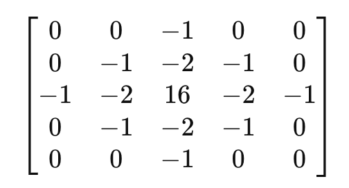

## Outline

- 图像分割
- 边缘检测
- 图像局部主导方向分析

本部分内容基于EE7403，不属于EE6222部分。

#### 图像分割 Segmentation

图像分割是将图像划分成多个有意义的区域，当已经成功提取出感兴趣的对象时，分割过程就应该停止。

传统的图像分割算法主要基于像素的相似性（阈值定义相似区域）和不连续性（像素突变）来划分。

基于阈值的分割可表示为：

$$
g(x,y) =
\begin{cases} 
1, & \text{if } f(x,y) > T \\
0, & \text{if } f(x,y) \leq T
\end{cases}
$$

  T 作为门槛值，可表示为：

$$
T = T[x,y,p(x,y),f(x,y)]
$$

其中 T 可选择为：

- 全局阈值
  基于全图的灰度值决定，适用于光照均匀的图像，比如黑白文本识别
- 局部阈值
  依赖于像素点和邻域点的灰度值，适用于光照不均匀的图像。其周围的像素特征可以表示为 $p(x,y)$
- 自适应阈值
  每个区域像素变化值不一样，适用于复杂的图像

**启发式确定全局阈值：**

- 选择一个初始估计值 𝑇
- 使用 𝑇 对图像进行分割，这将产生两个像素组：
  - $G_1$：所有灰度值 > $T$ 的像素
  - $G_2$：所有灰度值 ≤ $T$ 的像素
- 计算这两个区域的像素的平均灰度值 $\mu_1$ 和 $\mu_2$
- 计算新的阈值，公式如下：

$$
T = 0.5 \times (\mu_1 + \mu_2)
$$

- 重复步骤 2 到 4，直到连续迭代中的阈值 $T$ 小于与设定参数

**自适应局部阈值**

- 将原始图像划分为小区域

  - 初步分割后，可以通过直方图分析确定那个区域错误分割后，进一步分割
- 对不同的子区域选择不同的阈值进行分割

**不连续性检测**

最简单的方式是用一个卷积滤波器来检测图像中的不连续性。设计不同的滤波器。

三种不连续检测的方法：

- 点检测

  $$
  \begin{bmatrix}
  -1 & -1 & -1 \\
  -1 & 8 & -1 \\
  -1 & -1 & -1
  \end{bmatrix}
  $$

  $$
  R= \sum_{i=1}^{9} w_i z_i
  $$

  可识别出孤立的中心点。
- 线检测

  - Horizontal Edge Detection Kernel

  $$
  \begin{bmatrix}
  -1 & -1 & -1 \\
  2 & 2 & 2 \\
  -1 & -1 & -1
  \end{bmatrix}
  $$

  - +45° Edge Detection Kernel

  $$
  \begin{bmatrix}
  -1 & -1 & 2 \\
  -1 & 2 & -1 \\
  2 & -1 & -1
  \end{bmatrix}
  $$

  - Vertical Edge Detection Kernel

  $$
  \begin{bmatrix}
  -1 & 2 & -1 \\
  -1 & 2 & -1 \\
  -1 & 2 & -1
  \end{bmatrix}
  $$

  - -45° Edge Detection Kernel

  $$
  \begin{bmatrix}
  2 & -1 & -1 \\
  -1 & 2 & -1 \\
  -1 & -1 & 2
  \end{bmatrix}
  $$

#### 边缘检测

边缘检测是检测灰度级不连续最常用的方法。我们可以使用边缘检测滤波器，提取图像的轮廓（非线性）信息。将边界看作连接两个区域的像素点。

最常见的方法：

- 一阶导数：梯度算子（像素强度变化最快的方向）
- 二阶导数：拉普拉斯算子（计算梯度的变化率）

但以上两种算法受到噪声的影响很大，在使用之前，应该先对图像做平滑处理（低通滤波）。

确定一个点是边缘点的方法：

- 该点的灰度级变化比背景明显更强
- 使用阈值判断是否显著
- 二阶导数大于设定值

**一阶导数**
一阶导是梯度，检测亮度变化最大的方向。

$$
\nabla f(x,y) =
\begin{bmatrix}
G_x(x,y) \\
G_y(x,y)
\end{bmatrix} =
\begin{bmatrix}
\frac{\partial f(x,y)}{\partial x} \\
\frac{\partial f(x,y)}{\partial y}
\end{bmatrix}
$$

可知：

$$
G = |\nabla f(x,y)| = \left[ G_x^2(x,y) + G_y^2(x,y) \right]^{\frac{1}{2}}
$$

$$
\varphi(x,y) = \tan^{-1} \left( \frac{G_y(x,y)}{G_x(x,y)} \right)
$$

- 如果 $G$ 值很大则代表此处是边缘
- $\varphi(x,y)$ 表示像素变化最大的方向，垂直于边缘

离散图像差分后：

$$
G_x(x,y) = f(x+1, y) - f(x-1, y)
$$

$$
G_y(x,y) = f(x, y+1) - f(x, y-1)
$$

因此可看作是在$f(x,y)$上的卷积

因为其受到噪声的影响很大，所以在梯度计算前需要先做平滑。

$$
\nabla [h(x,y) * f(x,y)] = [\nabla h(x,y)] * f(x,y)
$$

其中，$\nabla h(x,y)$ 是梯度算子。不同的滤波器要设计不同的梯度算子

| 滤波器\( $h(x,y)$ )      | 对应的梯度算子\( $\nabla$ $h(x,y)$ \) | 特点                       |
| --------------------------- | ------------------------------------------- | -------------------------- |
| 均值滤波（Box Filter）      | Prewitt 算子                                | 计算简单，容易受噪声影响   |
| 高斯滤波（Gaussian Filter） | Sobel 算子                                  | 具有一定平滑能力，抑制噪声 |

可能存在的问题是：因为先进行了平滑滤波，可能会导致梯度方向出现偏差。

因此：X. Jiang, Extracting Image Orientation Feature by Using Integration Operator 提出了一种新的滤波器：

$$
\begin{bmatrix}
1 & 0 & -1 \\
4 & 0 & -4 \\
1 & 0 & -1
\end{bmatrix}
$$

**二阶导数**

拉普拉斯算子：

$$
\nabla^2 f = \frac{\partial^2 f(x,y)}{\partial x^2} + \frac{\partial^2 f(x,y)}{\partial y^2}
$$

因为是离散的，所以其有限差分后表达式为：

$$
\nabla^2 f = f(x+1, y) + f(x-1, y) + f(x, y+1) + f(x, y-1) - 4f(x, y)
$$

左侧图用于检测垂直和水平边沿，右侧图用于增加检测对角方向

拉普拉斯算子对噪声也是极度敏感，所以在处理前也应先做平滑。

$$
\nabla^2 (h * f) = (\nabla^2 h) * f
$$

LoG (Laplacian of Gaussian) 先对图像做高斯平滑，其卷积核为：

- 系数和必须为0
  

通过上述的方法可以检测出边界，接下来需要将检测出来的边界合在一起，形成连贯的边界。主要包含的方法：

- 局部检测
  根据像素的局部信息，确定如何连接。容易受到噪声的影响。
- 全局检测
  **Hough 变换**
  - 核心思想是：将边界从原始坐标空间映射到参数空间（极坐标空间），在参数空间对所有的参数投票，找到投票最多的参数，就是可能存在的边界，将其在映射回原始坐标。

综上，边界检测的步骤为：

- 通过一阶/二阶梯度计算，增强边界信息，转化为二值图像
- 在hough空间划分网格单元，对每个网格单元进行投票
- 找到投票最多的网格单元，将其映射回原始坐标空间，得到边界
- 对边界中的间隙进行连接，得到完整的边界

#### 局部主导方向

局部主导方向代表了某一区域内的主导方向，主要表示图像中的边缘、线条等信息。在指纹识别、纹理分析等很有用。

前面的做法都是先平滑在求梯度，实际相当于对所有像素点梯度做加权平均。但是梯度方向和边缘方向存在不对称，则两个方向相反的梯度向量，而且梯度的方向$\theta(x,y) \in (0\degree,360\degree]$, 而边缘的方向$\phi(x,y) \in (0\degree, 180\degree]$在求和的时候可能会相互抵消，导致出现错误。

一个解决方法：平滑平方梯度向量

- 思路就是将梯度方向和边缘的方向对齐，平滑其平方梯度

  $$
  \Delta f(x,y) = G_x(x,y)+jG_y(x,y) = |\Delta f(x,y)|e^{j\theta(x,y)}
  $$

  $$
  [\Delta f(x,y)]^2 = G_x(x,y)^2 - G_y(x,y)^2 + 2jG_x(x,y)G_y(x,y)=|\Delta f(x,y)|^2e^{j2\theta(x,y)}
  $$
- 其方向可以定义为：

  $$
  \overline{\theta(x,y)} = \frac{1}{2} \tan^{-1} \left( \frac{2C}{A - B} \right)
  $$

  因为是平方之后角度加倍$e^{j\theta}$变为$e^{j2\theta}$，所以需要将角度减半恢复原来方向
  其中：

  $$
  A = \sum_{(s,t) \in S_{xy}} G_x^2(s,t), \quad
  B = \sum_{(s,t) \in S_{xy}} G_y^2(s,t), \quad
  C = \sum_{(s,t) \in S_{xy}} G_x(s,t) G_y(s,t)
  $$
- 幅值为：

  $$
  \left| \overline{[\nabla f(x,y)]^2} \right| = \sqrt{(A - B)^2 + 4C^2}
  $$
- 平均幅值为：

  $$
  \overline{|\nabla f(x,y)|^2} = A + B
  $$
- 各向异性(anisotropy)/相干性(coherence)为：

  $$
  \textit{coh}(x,y) = \frac{\left| \overline{[\nabla f(x,y)]^2} \right|}{\overline{|\nabla f(x,y)|^2}} = \frac{\sqrt{(A - B)^2 + 4C^2}}{A + B}
  $$

  - $\textit{coh}(x,y) = 0$ 表示完全各向同性，所有梯度方向高度一致
  - $\textit{coh}(x,y) = 1$ 表示完全各向异性，所有梯度方向杂乱无章
- 存在问题

  - 对于噪声敏感
  - window size 有tradeoff
    - 太大，过于平滑，丢失细节
    - 太小，对于噪声过于敏感
