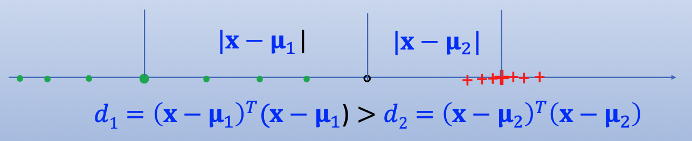

Outline

- template matching
- classification

本篇内容基于EE6222

#### Template matching

针对一个未知物体的识别，直觉的做法就是：将其与已知的数据库中数据做对比。做对比的方法包括：

- 欧式距离

$$
d = \| F - G \| = \sum_{y=1}^{q} \sum_{x=1}^{p} \left[ f(x, y) - g(x, y) \right]^2
$$

其中：$F$ 为待识别图像，$G$ 为数据库中的图像，$f(x, y)$ 和 $g(x, y)$ 为图像像素的灰度值。

存在问题：即使图像很相似，但是亮度和对比度不同，也会导致距离很大。

**解决方案：将图像归一化**

$$
f_n(x, y) = \frac{f(x, y) - \mu_f}{\sigma_f}
$$

其中：$\mu_f$ 为图像的均值，$\sigma_f$ 为图像的标准差。

**所以欧式距离转化为：**

$$
d_n = (f_n - g_n)^T (f_n - g_n)
$$

- 相关系数

$$
\gamma = \frac{( \mathbf{f} - m_f )^T ( \mathbf{g} - m_g )}{ \| \mathbf{f}_c \| \| \mathbf{g}_c \| }
$$

其中：$m_f$ 和 $m_g$ 为图像的均值向量，$\mathbf{f}_c$ 和 $\mathbf{g}_c$ 为图像的中心化向量。$\| \mathbf{f}_c \|$ 为模长。

可知：$\gamma$ 的取值范围为 $[-1, 1]$，$\gamma$ 越大，图像越相似。

本质上是cosine相似度的一种变形。

**将图片与已知的图片一一比较，也可以看作是一个分类的过程。因为每个物体包含很多张图片，将图片与物体关联，实际上也是将图片分到这个“物体”类中。**

#### 分类方法

- k nearest neighbor 方法

  - 已知训练样本集合${x_1, x_2, ..., x_n}$, 其中每个样本都有标签。测试样本为 $x$。
  - 计算 $x$ 与每个训练样本的距离，找到距离最小的 $k$ 个样本。
  - 这 $k$ 个样本中出现次数最多的标签，作为 $x$ 的标签。

  存在问题：

  - 如果训练样本集有很多样本，则对比测试样本与每个样本的距离的计算成本很高
  - 对训练样本通常会overfitting, 泛化性不好

  解决方案1：
  - 不与每个样本对比距离，仅与分类中心做对比
    $$ { G_k = \arg\min_j \left\| \mathbf{f} - \mu_j \right\| } $$

    其中 $\mu_j$ 为第 $j$ 类样本的中心，$\mathbf{f}$ 为测试样本特征向量
  
  但仍存在问题：
  

  解决方案2：
  - 归一化距离，马氏距离 Mahalanobis distance
    $$ { \mu_j = \frac{1}{q_j} \sum_{x_i \in \omega_j} x_i } $$  

    $$ { \Sigma_j = \frac{1}{q_j} \sum_{x_i \in \omega_j} (x_i - \mu_j)(x_i - \mu_j)^T } = \frac{1}{q_j} \sum_{x_i \in \omega_j} x_i x_i^T - \mu_j \mu_j^T  $$

    $$ { d_{Maj} = ( \mathbf{x} - \mu_j )^T \Sigma_j^{-1} ( \mathbf{x} - \mu_j ) } $$
    
    如果每一个类别的样本都服从高斯分布，则最小马氏距离分类器是最好的分类器。
  
  但仍存在问题：
  如果样本存在很多个类别，且每个类别内的数据很少，则会导致协方差矩阵不满秩，无法求逆，计算结果不稳定。

  解决方法：引入类间和类内分布
  - 类内散布矩阵
    $$ { S^w = \frac{1}{q} \sum_{j=1}^{c} q_j \Sigma_j } $$

  - 类间散布矩阵
    $$ { S^b = \frac{1}{q} \sum_{j=1}^{c} q_j (\mu_j - \mu)(\mu_j - \mu)^T } $$
  
  - 类内和类间散布矩阵
    $$ { S^t = \Sigma^w + \Sigma^b } $$

  马氏距离主要考虑类内距离，可以用$S^w$代替协方差矩阵$\Sigma$。
  $$ { d = (\mathbf{x} - \mu)^T S^w (\mathbf{x} - \mu) } $$
