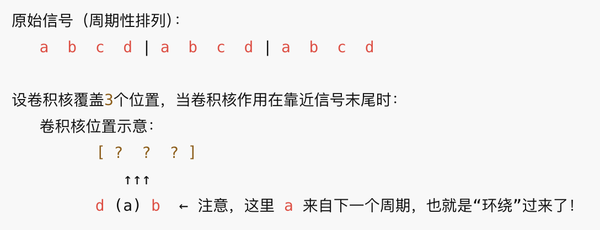

## LSI

Linear Shift-Invariant System 线性时不变系统

- 主要性质
  - Linearity: 系统的输入和输出满足叠加定理，如果输入信号是两个信号的加权和，输出也是两个信号的加权和
  - Shift-Invariance: 系统的特性不会随着输入信号的时空位置而改变。输入信号延迟，输出信号也会延迟

对于整个图片的表示：

### Convolution:
- output: g(x,y)      
- input:f(x,y)
- impulse: h(x,y)
- --> g(x,y) = f(x,y) * h(x,y)

### h(x,y)

- h(x,y) 是当输入系统是单位脉冲时，产生的输出图像
- when h(x,y) is an image, it calls spatial representation of a filter。并且是图片的话，一般都是很小的图片

## Fourier Transform
将信号分解为不同频率的正弦波和余弦波的叠加，将信号从时域转化到频域。

- 可分性
  - 如果时域可分，则频域可分
  - f(x,y) = f1(x)f2(y) --> F(u,v) = Fx(u)Fy(v)
- F(u,v) 是复函数